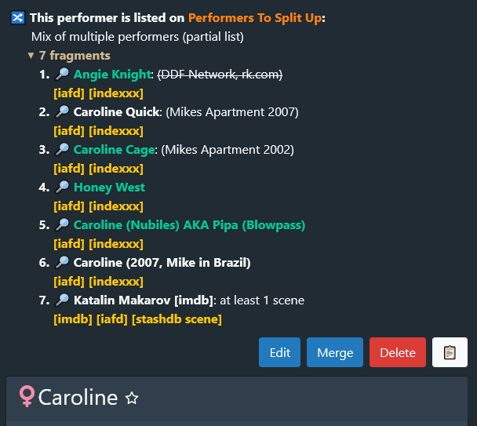
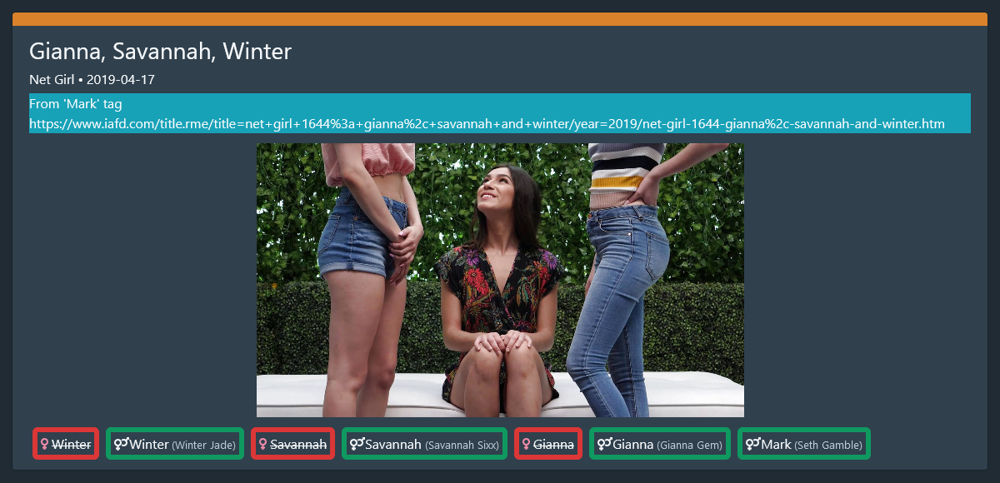

# StashDB Backlog Userscript

This userscript displays the pending changes from the StashDB Backlog spreadsheet directly on StashDB.  
The data is usually synced every hour, starting at midnight UTC.
## [**INSTALL USERSCRIPT**](https://github.com/peolic/stashdb-backlog-userscript/raw/HEAD/stashdb-backlog.user.js)

Installation requires a browser extension such as [Violentmonkey] / [Tampermonkey] / [Greasemonkey].

### Screenshots

[Violentmonkey]:https://violentmonkey.github.io/
[Tampermonkey]:https://www.tampermonkey.net/
[Greasemonkey]:https://www.greasespot.net/
